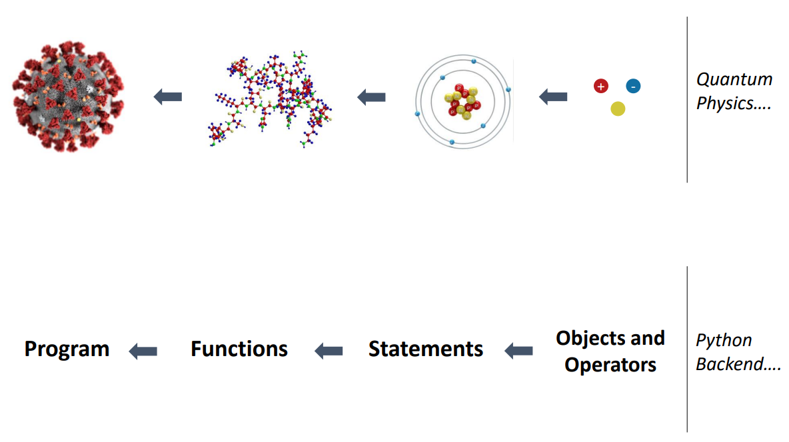
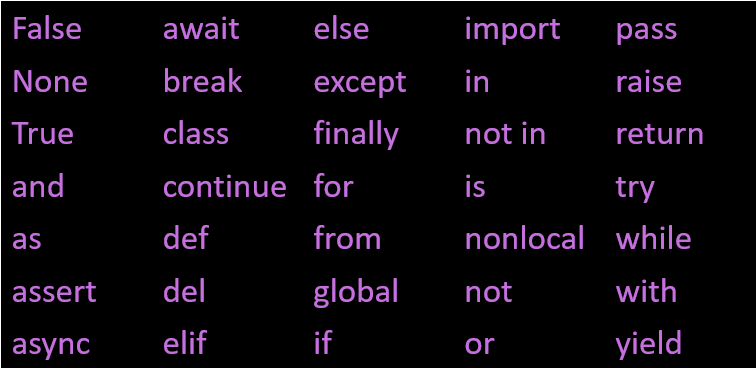

# Data Types, Operators, and Expressions

## Introduction

In the world of programming, a **program** is akin to a recipe. Just as a recipe provides step-by-step instructions to create a dish, a program offers a sequence of instructions (or **statements**) that dictate how to perform a computation. This could range from mathematical tasks, like solving equations, to more complex operations, such as image processing.

For instance, with Python, you can:
  - Solve a system of equations
  - Find the roots of a polynomial
  - Search and/or replace text in a document
  - Make a graph or plot of data
  - Process an image

While you can write entire programs, Python also offers the flexibility to run individual statements in the **console**, allowing for quick tests and calculations.

**Simplistic hierarchy of a program:**

## Objects and Data Types

Objects are the fundamental building blocks in Python. They can be assembled into statements to construct more complex programs. These objects come in various types, each with its unique properties and behaviors.

### Numeric Data Types

Python offers a variety of numeric data types:

| Type | Description | Example |
|------|-------------|---------|
|`int`|Integer (whole numbers)|`5` or `3`|
|`float`|Real (floating point) number|`3.14`|

### String Data Type

Strings are sequences of characters:

| Type | Description | Example |
|------|-------------|---------|
|`str`|String|`"Hello, World!"` or `'Python is fun!'`|

### Boolean Data Type

Boolean data type represents the truth values:

| Type | Description | Example |
|------|-------------|---------|
|`bool`|Boolean|`True`, `False`|

### Data Type Inheritance and Ranks

When you perform operations between different data types, Python will often promote the result to the "highest rank" data type involved. For instance, an operation between an `int` and a `float` will yield a `float`.

### Keywords

Keywords are reserved words in Python that have special meanings:

> **Note**: These keywords cannot be used as variable names or identifiers.

## Operators

Operators act on objects to perform operations. The type of operation and the result depends on the type of objects being operated on.

### Numeric Operators

Python provides basic math operators, organized by precedence:

| Operator | Description | Precedence |
|----------|-------------|------------|
| `**`     | Exponentiation | High |
| `*`, `/`, `//`, `%` | Multiplication, Division, Floor Division, Modulus | Medium |
| `+`, `-` | Addition, Subtraction | Low |

### Boolean Operators

Comparison and logical operators:

| Operator | Description |
|----------|-------------|
| `==`, `!=` | Equal, Not equal |
| `>`, `<`, `>=`, `<=` | Comparison operators |
| `and`, `or`, `not` | Logical operators |

### String Operators

String operations in Python:

| Operator | Description |
|----------|-------------|
| `+` | Concatenate |
| `*` | Repetition |
| `[]` | Slicing |
| `in`, `not in` | Membership |

### Precedence

Just like in mathematics, operators in Python follow a specific order of operations, or **precedence**. This ensures that expressions are evaluated in the correct order.

For instance, multiplication and division have higher precedence than addition and subtraction. This means that in the expression `5 + 3 * 2`, the multiplication is performed before the addition, resulting in `11` and not `16`.
