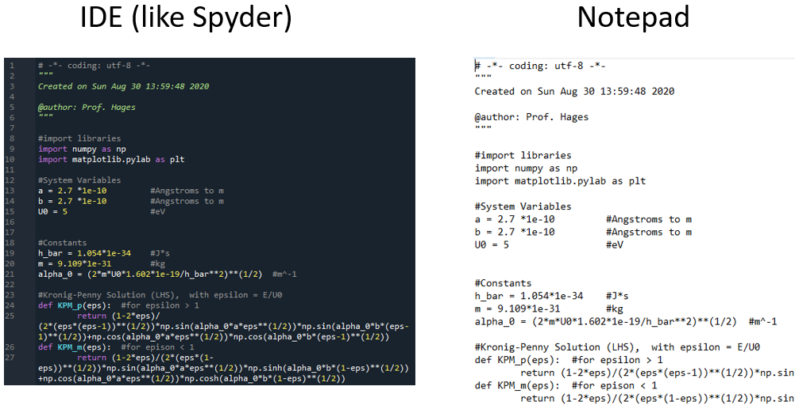
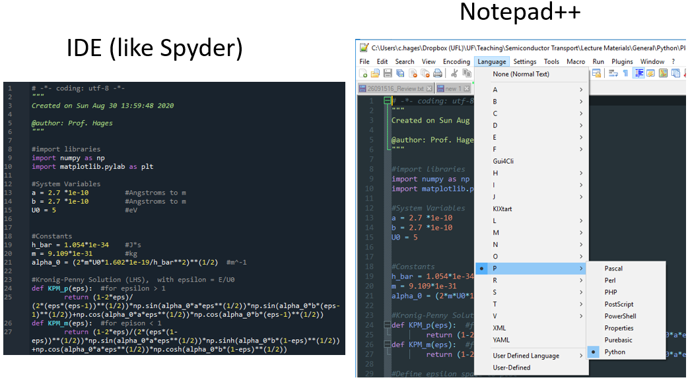

# Lecture 2: Data Types, Operators, and Expressions

## Introduction

A **program** is a sequence of instructions (<ins>statements</ins>) that dictate how to perform a computation.
  - Solve a system of equations
  - Find the roots of a polynomial
  - Search and/or replace text in a document
  - Make a graph/plot of data
  - Process an image

Individual statements can be run in the **console**

**Simplistic hierarchy of a program:**

## Basic Numeric (Math) Operators in Python

Python provides basic math operators:
  - `+` : Addition
  - `-` : Subtraction
  - `*` : Multiplication
  - `/` : Division
  - `//`: Floor Division
  - `**`: Exponentiation
  - `%`: Modulus

Operators and objects can be used to build statements.
  
A statement that evaluates to produce a result is called an <ins>expression</ins>

Example:
- Expression: `5*3`  Result: `15`

### Precedence

Expressions evaluate by “Order of Operations” or <ins>precedence<\ins>.
> Think PEMDAS

| Symbol    | Precedence |
| -------- | ------- |
| `+` and `-`  | Low |
| `/` and `//` and `*` | &uarr; |
| `**` | High |

Operators with equivalent precedence evaluate left-to-right. Same basic idea as your calculator…

---
Examples:
- `5+3+2`
    (add result in display to click)
- `5+3*2`
    (add result in display to click)
---

## Data Types

### Numeric data types:

| Type | Description | Example |
|------|-------------|---------|
|`int`|integer|`5` or `3`|
|`float`|Real (floating point) number|`3.14`|

Operators act on objects depending on their <ins>type</ins>.

Use `type()` to determine the data type

### Python Code is just plain text

### Data Type Inheritance

- Conversion functions: `int()`, `float()`, `str()`

## Keywords

Reserved words in Python:

- `False`, `await`, `else`, `import`, `pass`, ... (and so on)

> **Note**: These keywords have special meanings and purposes built into the Python language.

## Boolean Operators

Basic boolean (comparison) operators in Python:

- `==`: Equal
- `!=`: Not equal
- `>` : Greater than
- `<` : Less than
- `>=`: Greater than or equal to
- `<=`: Less than or equal to

Logical operators:

- `or` : Returns True if one of the expressions is true
- `and`: Returns True if both expressions are true
- `not`: Reverses the Boolean result of an expression

## String Operations

String operations in Python:

- `in` or `not in`: Membership Operator
- `+`: Concatenate
- `*`: Repetition
- `[]`: Slicing

> **Note**: Python's zero-based indexing and the importance of capitalization.

## Assignment

Concept of assignment in Python:

- Variables reference values in memory.
- Rules for naming variables.

## iPython Console

Features of the iPython console:

- Caching inputs/outputs.
- Distinction between statements and expressions.
- The role of the `print()` function in displaying results.

## Editor

Using an editor to write and evaluate multiple expressions.

## Operator Precedence

Summary of operator precedence in Python, from highest to lowest.

## Summary

Key concepts discussed in the document.

## Bonus

Introduction to the `NoneType` in Python.
