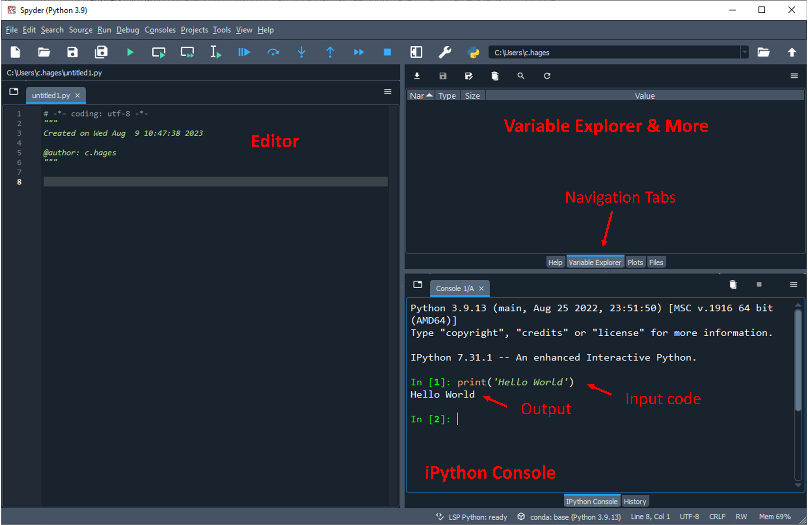

# An Introduction to Python: 1. Getting Started

## 1. What is Python?

Python is a versatile programming language compatible with a wide range of operating systems, including Windows, Mac OS, Linux, and Android. As an interpreted language, Python can execute commands directly, eliminating the need for compilation.

## 2. Why Python?

- **Open-source**: Python is free and open-source (meaning you can download the entire source code)
- **Versatility**: Python is one of the fastest-growing programming languages globally due to its versatility and ease of use. It's suitable for various applications, from app/game development, website development, machine learning and AI, image processing, as well as advanced math and data science.
- **Community Support**: Python is backed by a large community of programmers. This vast support community ensures that solutions to common problems are readily available. If coders run into a stumbling block or have a question about something in Python, finding a solution is relatively easy; somebody is bound to have encountered the same problem.
- **Academic Preference**: Python has become the go-to computing language in academia. It offers the same (or even better) functionality and simplicity as other paid software like MatLab and Mathematica, but for free.
- **Real-world Applications**: Python is not just popular in academia; it's also widely adopted in the industry. Here are some notable examples:

  - **Web Development**: Websites like **Instagram**, **Pinterest**, and **Spotify** use Python, particularly the Django framework, for their backend.

  - **Data Analysis and Visualization**: Companies like **Netflix** and **Dropbox** use Python for data analysis to gain insights and improve their services.

  - **Artificial Intelligence and Machine Learning**: **Google** uses Python for its machine learning applications, and its TensorFlow library, one of the most popular ML libraries, is written in Python.

  - **Finance**: **J.P. Morgan** and other major banks use Python for financial market forecasting.

  - **Gaming**: Games like **Civilization IV** have used Python for various purposes, including scripting.

  - **Scientific Computing**: Organizations like **NASA** and **CERN** use Python for scientific programming and data analysis.

  - **Automation**: Many companies, big and small, use Python to automate repetitive tasks, from data entry to testing.

  Python's versatility ensures its adoption across a myriad of applications, from web apps to scientific research.

## 3. Installation

- **Anaconda Distribution**: We recommend the Anaconda distribution of Python for this course. It bundles many essential packages for engineers and scientists. The distribution is open source and free. This distribution also comes with several very useful applications to make it easy to use Python for different purposes. We will be using the **Spyder** application which comes with Anaconda.  **Spyder** is a **S**cientific **Py**thon **D**evelopment **E**nvi**R**onment with useful features for code editing, visualization, and debugging – particularly for scientific and math applications. 
- **Installation Steps**:
  1. Visit [Anaconda's download page](https://www.anaconda.com/download).
  2. Download the installer.
  3. Follow the onscreen instructions. It's simplest to use default locations and options for everything.

## 4. Getting Started with Spyder

- **Launching Spyder**: Once you've installed Anaconda, launch the “Spyder” application. You can find it in your computer's program list or through the “Anaconda Navigator”.
- **Spyder Layout**: Upon opening “Spyder”, you'll notice three main panels:
  1. **Editor Window (Left)**: Where you can write and save Python scripts.
  2. **Variable Explorer and File Explorer (Top Right)**: Displays variables in use and allows for easy file navigation.
  3. **iPython Console (Bottom Right)**: An interactive Python shell to execute commands.

  If this is your first time using Spyder, it may be helpful to click the “Start Tour” button when you first open the program. 

  

- **Your First Command**: In the iPython console (Bottom Right), type the following command and hit Enter:
  ```python
  print('Hello World')

## 5. Working with Scripts in Spyder

- **Creating a Script**: Type your Python code into the editor window. For instance, you can type the `print('Hello World')` command.
- **Running a Script**: After typing your code, click the "Run File" button to execute the script. The output will appear in the iPython console.

  

- **Saving Scripts**: Before running your script, it's a good practice to save it. You should create a dedicated folder for this course to organize your scripts. To save, navigate to `File > Save As` in Spyder's toolbar. Python scripts have a `.py` extension.

   > **_Note on saving:_**  When you run a script using the "Run File" button, Spyder will automatically save the script.
   >
   > If the script in the editor panel has not been previously saved, Spyder will generate a new file. When generating a new file, a default file name like `untitled0.py` will be used, and the script will be saved to the current working directory in Spyder (which is displayed on the top right of the Spyder IDE window). For this reason, it is best practice to manually save your scripts so you can keep them organized with appropriate file names and in an organized directory for this class.
   >
   > If the script has previously been saved, clicking the "Run File" button will overwrite the previous version of the file. If you want to keep the previous version, make sure to manually save the file with a new filename before running the script. (You can tell if any changes have been made to the script since it was last saved by the appearance of an asterisk following the filename displayed at the top of the editor panel.)

- **Opening Scripts**: To open a previously saved script, go to `File > Open`. While these `.py` files can be opened in text editors like Notepad, using Spyder offers specialized features for Python coding.

## Terminology 

- **Script**: A set of instructions written in a programming language.
- **IDE (Integrated Development Environment)**: Software that provides comprehensive tools for software development, like Spyder for Python.

## FAQ

- **Q**: I encountered an error in Spyder. What should I do?
  - **A**: Don't panic! Errors provide feedback. Read the error message, understand it, and try to fix the issue. If stuck, remember the vast Python community is there to help. A quick Google search can often provide a solution.

---

**Congratulations!** You wrote your first computer program!

